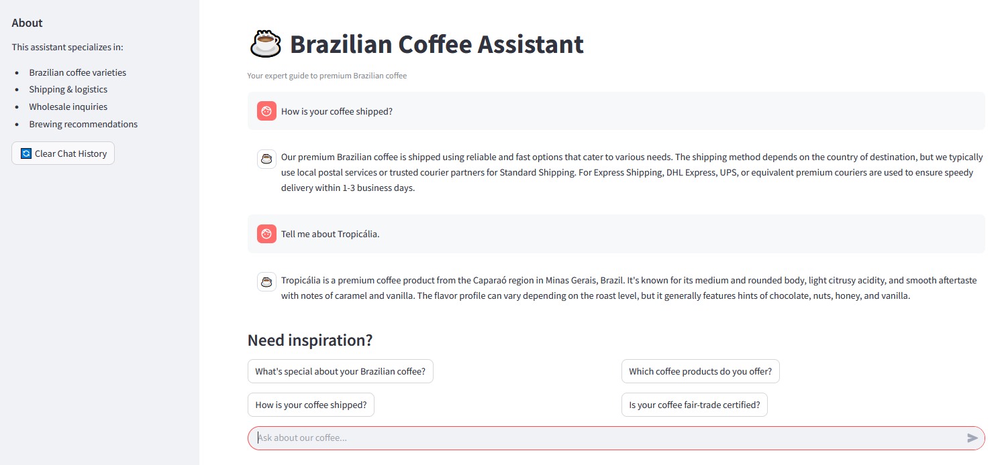

# ☕ Brazilian Coffee Assistant

<p align="center">
  
</p>

---

A friendly, AI-powered chatbot built with [Streamlit](https://streamlit.io/) and [LangChain](https://www.langchain.com/) to answer all your questions about our premium Brazilian coffee — from products and shipping to company background and brewing advice.

---

## 🚀 Features

- 💬 Interactive Q&A about coffee products, company info, shipping, and FAQs
- 🧠 Vector-based knowledge search powered by Chroma & HuggingFace embeddings
- 🤖 Local LLM integration via [Ollama](https://ollama.com/) using `llama3.1`
- 📝 Uses markdown or text files in a `/knowledge_base` folder
- 🔍 Semantic document chunking for accurate answers
- 🌐 Streamlit UI with saved chat history and clickable example questions

---

## 📁 Project Structure

\`\`\`
coffee_chatbot/
│
├── chatbot_v10-2-3.py        # Main Streamlit app
├── knowledge_base/           # Folder containing markdown/txt documents
│   ├── company_info.md
│   ├── products.md
│   ├── shipping.md
│   └── faq.md
├── requirements.txt          # Python dependencies
├── .gitignore                # Files to exclude from version control
└── README.md                 # You're here!
\`\`\`

---

## 🛠️ Installation

### 1. Clone the Repo

```bash
git clone https://github.com/your-username/coffee_chatbot.git
cd coffee_chatbot
```

### 2. Set Up a Python Environment

\`\`\`bash
python -m venv venv
source venv/bin/activate  # On Windows: venv\Scripts\activate
pip install -r requirements.txt
\`\`\`

### 3. Run the Streamlit App

Make sure [Ollama](https://ollama.com/) is running locally and supports the model in \`AppConfig\`.

\`\`\`bash
streamlit run chatbot_v10-2-3.py
\`\`\`

---

## ⚙️ Requirements

See \`requirements.txt\`. Key libraries include:

- \`streamlit\`
- \`langchain\`
- \`langchain_community\`
- \`langchain_huggingface\`
- \`sentence-transformers\`
- \`chromadb\`
- \`requests\`

---

## 💡 Adding Knowledge

Just drop new \`.md\` or \`.txt\` files into the \`knowledge_base/\` folder. The app will index them automatically on startup.

---

## 🐳 Docker Support (Optional)

You can run this app in Docker. Add a \`Dockerfile\` and build like:

\`\`\`bash
docker build -t coffee-chatbot .
docker run -p 8501:8501 coffee-chatbot
\`\`\`

---

## 📬 Example Questions

- “What’s special about your Brazilian coffee?”
- “How is your coffee shipped?”
- “Is your coffee fair-trade certified?”
- “What types of coffee do you offer?”

---

## 📄 License

MIT License. Feel free to modify and use this project commercially or personally.

---

## ☕ Made with passion for Brazilian coffee.
EOF
)' > README.md
